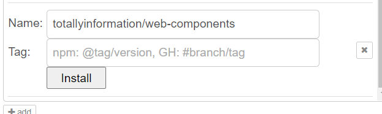
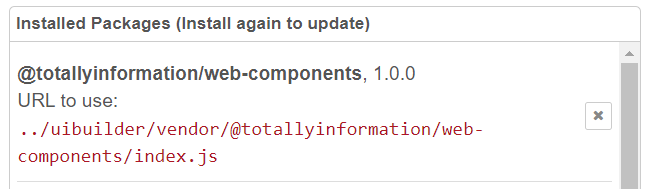

# web-components

[](https://www.jsdelivr.com/package/gh/TotallyInformation/web-components)

A repository of simple W3C Web Components. These have specific capabilities for use with node-red-contrib-uibuilder but will work independently as well.

> **NOTE**: Currently, all of the components should be considered *experimental*. Most will work fine though may be overly simplistic in places. However, all are subject to significant change. Also note that the documentation is incomplete and may be wrong in places.

Additional documentation is available in the docs folder which is also exposed as a website at https://totallyinformation.github.io/web-components/.

## Components

Please note the warning about these being experimental right now. But please do give them a go and let me have some feedback.

Note that all of these components make use of the new `uib-brand.css` stylesheet which is light/dark switchable and all based off CSS variables and calculations so is very flexible.

| Name                | Description                                                  |
| ------------------- | ------------------------------------------------------------ |
| `button-send`       | A pre-defined button that fires an event and sends a uibuilder msg when clicked. Includes attribs in the sent data. |
| `container-br`      | Like `<br>` for flex layouts. Forces a new row in a `simple-container` (or any other flex row container) |
| `data-list`         | Data-driven UL/OL. Takes a JSON or JavaScript object or array of objects and outputs a formatted list. |
| `definition-list`   | Similar to `data-list` but outputs a DL instead.             |
| `html-include`      | Dynamically load external HTML content very easily without needing an iFrame. |
| `labelled-value`    | Text output with a label.                                    |
| `simple-card`       | A card container with optional header and footer. |
| `simple-container`  | A UI container for easy, automated layout of contained elements (specifically cards). |
| `syntax-highlight`  | A simple, easy to use JSON object highlight element. Auto settings for different types of uibuilder messages or manually pass the data. |
| `uib-theme-changer` | This only works with the `uib-brand` stylesheet or something crafted to be like it. Switch between light/dark/auto schemes, shift the base hue, contrast ratio, and 2 accent colours. |

## Other supporting files and folders

* `docs/` - documentation.

* `tests/` - stand-alone web pages that demonstrate the components.

  Note that to test these from within Node-RED, you will need to use a URL something like:

  `http://localhost:1880/uibuilder/vendor/@totallyinformation/web-components/tests/simple-card.html`

  Note that loading direct like this, the uibuilder connection will not work unless you change the `uibuilder.start()` parameters to match a deployed uibuilder instance. It is better to copy the test files into the `src` folder of a deployed uibuilder node and to adjust the URL's accordingly. The normal urls for the components when copied to your own uibuilder instance will be `../uibuilder/vendor/@totallyinformation/web-components/components/simple-card.js`, `../uibuilder/vendor/@totallyinformation/web-components/libs/uibuilder.module.js`, etc.

  If you want to use the files with CDN versions of the modules, you will need to copy them and change all of the URL's. The test files are set up to work from having the repo installed under uibuilder in Node-RED.

* `vscode-descriptors/ti-web-components.html-data.json`

  Enables IntelliSense for the components while editing HTML in VSCode.

  May not always be in step with the code until everything is finalised.

* `libs/uibuilder.module.js` - an alternative, uibuilder v5 compatible client library specifically designed for use as an ECMA module. Not quite feature comparible with the standard `uibuilderfe.js` library but is the future direction of the client. Written as a class, self-loads the correct socket.io client library, has brand new logging features. Provides a simple, jQuery like `$` selector function.

  Most importantly, it contains a new, data-driven UI creator that lets you send configuration messages to build a UI dynamically.

  Still a work in progress but quite usable already.

* `libs/uib-brand.css` - a copy of the alternate (new) stylesheet from uibuilder that these components can use.


## Requirements

These are the requirements for any web component to be included in this repository.

* MUST be standalone with no external requirements. Common internal library modules may be permitted however.
* MUST be useable in the majority of modern browsers, anything supporting ES2019+ should be usable. IE will not be supported.
* MUST use ES6+. Maxumum JavaScript version should be 2 years behind the leading edge and only features supported by the majority of mainstream browsers are allowed. Other features MAY be permitted as long as they are optional and do not produce errors.
* MUST be linted using ESLINT. SHOULD use JavaScript Standard format (with some variations documented in the `.eslintrc.js` file).
* MUST self-register the custom tag using `customElements.define`.
* MUST use a Class name using a _CamelCase_ version of the component name with an initial upper-case letter (e.g. `syntax-highlight` will be `export default class SyntaxHighlight extends HTMLElement { ... }` ).
  
* SHOULD have a `<slot>` to allow nested rich content (where it makes sense).
* SHOULD export a _camelCase_ version of the component-name which contains any useful methods and data. (e.g. `syntax-highlight` should export `syntaxHighlight`).
* SHOULD meet the [Web Components Gold Standard](https://github.com/webcomponents/gold-standard/wiki).

### HTML Standards limitations

* Custom HTML tags MUST use pascal-case with at least 1 `-`.
* Custom HTML tags MUST use lower-case attribute names.

## Installation and loading

You can use these components directly from the jsdelivr CDN by referencing like: `https://cdn.jsdelivr.net/gh/totallyinformation/web-components@master/components/button-send.js`. So no install is required if you are happy to load from the Internet.

### Local installation

If you wish to install locally, you can npm install from the GitHub repository with `npm install totallyinformation/web-components`. If these ever get published to npm, you would install with `npm install @totallyinformation/web-components`. However, note that, at this point, I am not intending to publish them quickly as they are still evolving quite rapidly.

If installing locally, you will need to make the installed `web-components/components/` folder available to your web server as a static resource folder.

### Using with Node-RED and uibuilder

If using with Node-RED, you can install the components with the help of node-red-contrib-uibuilder. The uibuilder node has a library manager feature and you should use that to install the repository direct from GitHub (requires uibuilder v5+). In that case, uibuilder adds the repository to its web server and you can access them as: `../uibuilder/vendor/@totallyinformation/web-components/components/button-send.js`. See below for details.

Also for Node-RED, you may wish to try out the experimental `libs/uibuilder.module.js` front-end library. See the documentation in the same folder. And you will probably want to use the css file from that same folder.

### Loading components into your web page

The individual component documentation contains details on how to load the component files. In general, however, there are two choices on how to load them. 

#### Load as an ECMA module

This is the preferred method. However, it is generally best to load via a script module. While you can load them via your HTML as a script link, you loose some capability this way.

```html
<script type="module" async>
   import '../uibuilder/vendor/@totallyinformation/web-components/components/simple-container.js'
</script>
```

#### Load from HTML with a script tag

They **must** be loaded as a type "module".

```html
<script type="module" async src="https://cdn.jsdelivr.net/gh/totallyinformation/web-components@master/components/button-send.js"></script>
```

Or from the local resource of course. Note that this is not recommended. It is better to load them from a script module and then you can use an import statement.

#### Load from a standard script

Alternatively, you can load them in your main JavaScript script using dynamic imports as:

```html
<script defer async>
   import('https://cdn.jsdelivr.net/gh/totallyinformation/web-components@master/components/button-send.js')
</script>
```

The disadvantage of this method is that the import function is asynchronous and so your own code may try to execute before the module has loaded. Generally, this won't matter if you aren't assigning the import to a variable. If you are, you may need to use top-level async or the promise-style then/catch.

The potential advantage of this approach is that you can access exported variables and methods from the component if any are available (see the syntax-highlight component for an example). 


## Stand-alone use

### Installation and loading

See the general information above.

### Using the components

See the [component documentation](docs) for specific usage information for each component.


## Use with [Node-RED](https://nodered.org/) and [node-red-contrib-uibuilder](https://github.com/TotallyInformation/node-red-contrib-uibuilder)

### Installation and loading

You can, of course, use the components direct from a CDN as shown above.

Otherwise, install this repository using the library manager in a uibuilder node in Node-RED.



Which results in something like:



Noting that this library does not actually have a default script so the listed on is spurious.

You can then access the components by loading them into your html or JavaScript as shown above.

### Using the components

The components can, of course, be used in the same way as if not using uibuilder. However, there are additional capabilities aimed at making their use in conjunction with Node-RED and uibuilder even easier. Specifically reducing the amount of code required to use them.

Components will automatically recognise when uibuilder is being used. They will each:

* Have a specific msg schema - when a msg with the matching schema is sent from Node-RED via uibuilder, a singular instance of the component on a page will be automatically updated. Where multiple instances are present, the msg must include an html id so that the msg will target that instance.

See the [component documentation](docs) for specific usage information for each component.


## Visual Studio Code (VSCode) Intelligence

VSCode supposts the use of HTML and CSS Custom Data JSON files that describe custom web components and CSS in a way that gives some intelligence to the editor when writing HTML and CSS code.

This collection of web components uses [Web Component Analyzer](https://github.com/runem/web-component-analyzer) to help document the components. It is also used to create an html custom data file that can be added to VSCode or to a specific workspace or folder settings to provide additional Intellisense help for the components.

To do so, find the html custom data setting in VSCode settings and add:

```
/path/to/totallyinformation/web-components/vscode-descriptors/ti-web-components.html-data.json
```

## Discussions and suggestions

The best place to ask questions, or suggest improvements about these components is the [GitHub discussion board for this repository](https://github.com/TotallyInformation/web-components/discussions).

## Contributing

If you would like to contribute to this node, you can contact [Totally Information via GitHub](https://github.com/TotallyInformation) or raise a request in the [GitHub issues log](https://github.com/TotallyInformation/web-components/issues).

<!-- Please refer to the [contributing guidelines](https://github.com/TotallyInformation/node-red-contrib-uibuilder/blob/master/.github/CONTRIBUTING.md) for more information. -->

## Developers/Contributors

- [Julian Knight](https://github.com/TotallyInformation) - the designer and main author.

   <a href="https://stackexchange.com/users/1375993/julian-knight"></a>

   Please also check out my blog, [Much Ado About IT](https://it.knightnet.org.uk), it has information about all sorts of topics, mainly IT related, including Node-RED.
